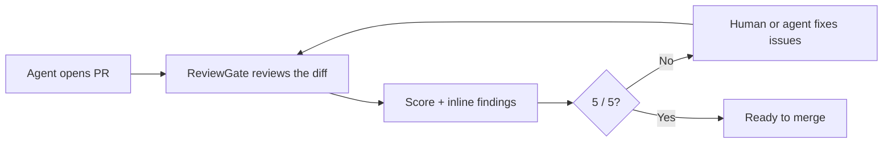

# ReviewGate

<p align="center">
  
</p>

<p align="center"><strong>Know when agent-written code is ready to merge.</strong></p>

<p align="center">
  <a href="https://reviewgate.lvtd.dev">Website</a> ·
  <a href="https://reviewgate.lvtd.dev/docs">Docs</a> ·
  <a href="https://github.com/LVTD-LLC/reviewgate/releases">Releases</a>
</p>

ReviewGate is an open-source GitHub Action that reviews pull requests with an AI model and gives each one a clear `0–5` score.

It runs in your GitHub Actions workflow with your own OpenRouter key. There is no ReviewGate account, hosted service, or code storage.



## What you get

- A visible `0–5` merge-readiness score.
- One summary comment that updates instead of multiplying.
- Inline findings with concrete repair instructions.
- Structured JSON that coding agents can read.
- Custom AI review prompts for your repository.

ReviewGate reviews code. It never edits code or merges a pull request for you.

## Install in 3 steps

### 1. Add your OpenRouter key

Create an [OpenRouter API key](https://openrouter.ai/keys), then add it as a GitHub Actions secret named `OPENROUTER_API_KEY`:

```bash
gh secret set OPENROUTER_API_KEY
```

Paste the key when GitHub CLI asks for it. Never put the key in a workflow, config file, commit, or AI prompt.

### 2. Add the workflow

Save this as `.github/workflows/reviewgate.yml`:

```yaml
name: ReviewGate

on:
  pull_request:
    types: [opened, synchronize, reopened, ready_for_review]

jobs:
  review:
    if: >-
      ${{
        github.event.pull_request.head.repo.full_name == github.repository &&
        github.actor != 'dependabot[bot]'
      }}
    runs-on: ubuntu-latest
    timeout-minutes: 20
    permissions:
      actions: read
      attestations: read
      contents: read
      pull-requests: write
      issues: write
      checks: write
      statuses: read
    concurrency:
      group: reviewgate-${{ github.workflow }}-${{ github.event.pull_request.number }}
      cancel-in-progress: true
    steps:
      - uses: actions/checkout@34e114876b0b11c390a56381ad16ebd13914f8d5
        with:
          ref: ${{ github.event.pull_request.head.sha }}
          fetch-depth: 0
          persist-credentials: false

      - uses: LVTD-LLC/reviewgate@v0
        with:
          openrouter_api_key: ${{ secrets.OPENROUTER_API_KEY }}
```

The fork guard is important: GitHub does not expose repository secrets to fork or Dependabot pull requests. Do not switch this workflow to `pull_request_target`.

### 3. Open or update a pull request

ReviewGate posts a summary, inline findings, and a check. A `5/5` passes; a lower score means there are validated issues to address.

## Let your AI agent set it up

Copy this prompt into your coding agent:

```text
Set up ReviewGate in this repository for GitHub pull request reviews.

Use https://reviewgate.lvtd.dev/docs and https://github.com/LVTD-LLC/reviewgate as the current setup contract. Inspect the repository first and preserve unrelated changes. Ask me which exact OpenRouter model ID to use; suggest deepseek/deepseek-v4-flash, ReviewGate's balanced default. Add the fork-safe GitHub Actions workflow and an appropriate .reviewgate.yml. Explain how I should add OPENROUTER_API_KEY without asking me to paste it. Validate the setup and report changed files, commands, and manual steps. Do not run a paid model review or change secrets without my approval.
```

The website also has a one-click **Copy setup prompt** button: [reviewgate.lvtd.dev](https://reviewgate.lvtd.dev).

## Configure the AI review

You can start without a config file. ReviewGate uses its built-in general and adversarial review angles.

Add `.reviewgate.yml` when you want to change what the AI looks for:

```yaml
min_severity: P2
deep: true
verify_blockers: true
review_angles:
  - id: correctness
    name: Correctness
    prompt: Check behavior, error handling, and regression risk.
  - id: product_rules
    name: Product rules
    prompt_file: review-prompts/product-rules.md
```

| Setting | Default | What it changes |
| --- | --- | --- |
| `min_severity` | `P4` | Lowest severity posted as an inline comment. |
| `deep` | `false` | Adds bounded, temporary repository context to the diff. |
| `verify_blockers` | `false` | Uses one extra model call to check blocker candidates. |
| `review_angles` | General + adversarial | Replaces the built-in list with your review instructions. |

### Write a useful AI prompt

Each review angle needs exactly one instruction source:

- `prompt` for one short instruction.
- `prompt_file` for a longer Markdown or text prompt.
- `skill` for a repository-local `SKILL.md`.

For a longer prompt, create a file such as `review-prompts/product-rules.md`:

```markdown
# Product rules review

Review only the changed behavior.

- Check the diff against PRODUCT.md and documented public contracts.
- Trace error and empty states that users can reach.
- Require repository evidence for every blocking finding.
- Do not report style preferences as defects.
```

Keep prompts specific: name the risks, contracts, and evidence the reviewer should inspect. When `review_angles` is present, it replaces the defaults, so include every angle you still want.

To choose a different OpenRouter model, set an exact model ID in the workflow:

```yaml
- uses: LVTD-LLC/reviewgate@v0
  with:
    openrouter_api_key: ${{ secrets.OPENROUTER_API_KEY }}
    model: anthropic/claude-sonnet-4
```

See the [configuration guide](https://reviewgate.lvtd.dev/docs/configuration) for prompt files, skills, timeouts, blocker verification, and every Action input.

## Ask for another review

Maintainers can add the optional rereview job and comment exactly:

```text
@reviewgate review
```

Use the [complete GitHub Actions setup](https://reviewgate.lvtd.dev/docs/github-actions) to enable safe, current-head rereviews.

## Use it from the terminal

Install the CLI on macOS or Linux:

```bash
curl --proto '=https' --tlsv1.2 -LsSf \
  https://raw.githubusercontent.com/LVTD-LLC/reviewgate/main/scripts/install.sh | sh
```

Or with Homebrew:

```bash
brew install LVTD-LLC/tap/reviewgate
```

Useful commands:

```bash
reviewgate check --pr 123
reviewgate review --pr 123 --wait
reviewgate upgrade
```

Read the [CLI guide](https://reviewgate.lvtd.dev/docs/cli) for local reviews and agent repair loops.

## Learn more

- [Quickstart](https://reviewgate.lvtd.dev/docs/quickstart)
- [GitHub Actions setup](https://reviewgate.lvtd.dev/docs/github-actions)
- [Configuration](https://reviewgate.lvtd.dev/docs/configuration)
- [Scores and findings](https://reviewgate.lvtd.dev/docs/features)
- [Structured artifacts](https://reviewgate.lvtd.dev/docs/artifacts)
- [Security model](https://reviewgate.lvtd.dev/docs/security)
- [Troubleshooting](https://reviewgate.lvtd.dev/docs/troubleshooting)
- [Contributing and repository internals](AGENTS.md)

## License

Apache-2.0. See [LICENSE](LICENSE).
